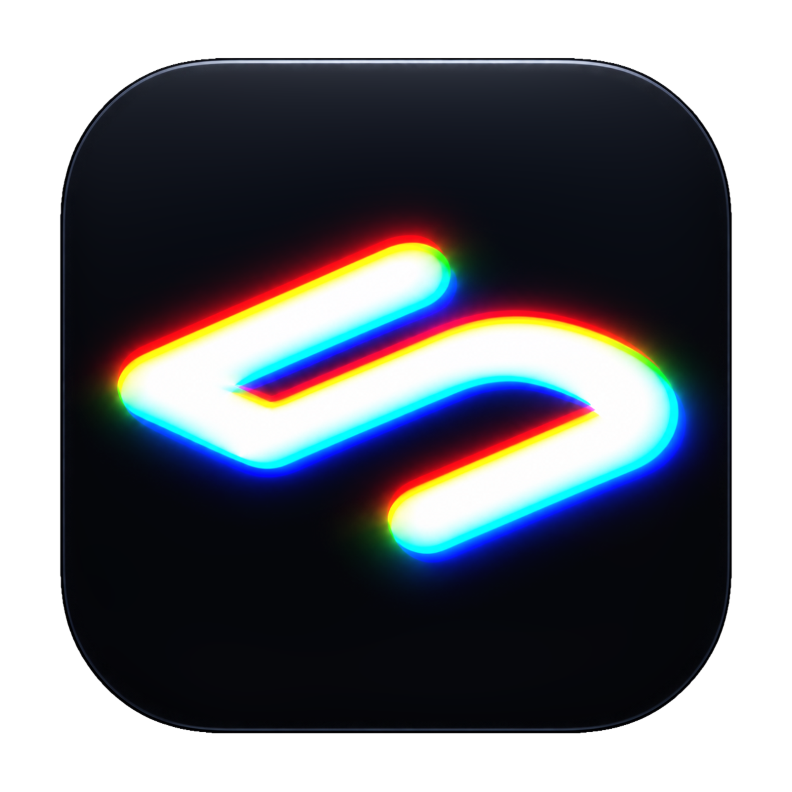
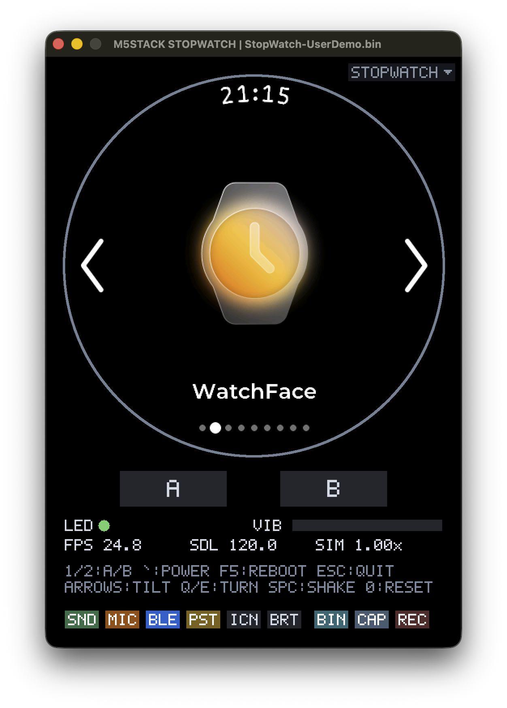

<div align="center">
  
  <h1>M5 Emulator</h1>
  <p>An unofficial QEMU-based M5Stack device emulator for firmware development and testing.</p>
  <p><strong>English</strong> | <a href="README.zh-CN.md">中文</a></p>
</div>

It currently supports **M5Stack StopWatch**.

Built with C++26, SDL2 and Espressif QEMU, it **runs original BIN firmware directly without modification**: the firmware's Xtensa instructions execute on an emulated ESP32-S3 CPU, without porting or recompiling the firmware as a desktop application.

It emulates the display, touch input, buttons, sensors and audio, and bridges Bluetooth communication through the host computer.

## Run

Open **M5 Emulator.app** and drop a `.bin` file into the window. Command-line arguments are optional.

<p align="center">
  
</p>

When emulating StopWatch, you can load either an ESP32-S3 application firmware BIN or a complete 16 MiB Flash image.

Application BINs use the bundled [bootloader](resources/esp32s3/README.md) and [default partition table](src/models/stopwatch/StopWatchFlash.hpp). The application is placed at `0x20000`, with a maximum size of `0x4F0000` bytes; unused Flash is filled with `0xFF`. Full Flash images retain their own bootloader, partitions and data. Applications must be compatible with the selected device and Flash layout.

The emulator uses a separate Flash save and never modifies the original BIN. Use `--no-persist` to run without saving Flash changes. `--state-flash FILE` selects a save file: if it does not exist, it is created from the BIN; otherwise, the existing save is used without reinitializing it from the BIN.

## Storage and logs

On macOS, application data is stored under `~/Library/Application Support/M5Emulator/`:

- `devices/<device-id>/flash/`: Flash saves for that device.
- `devices/<device-id>/recent-files.txt`: recent-file list for that device.
- `logs/`: each run's stdout and stderr logs; console output remains available.

Screenshots and recordings default to `~/Pictures/M5 Emulator/`. Use `--capture-dir DIR` to choose another directory.

## Hardware and compatibility

| Component | Devices | Implemented scope |
|---|---|---|
| ESP32-S3 | StopWatch | QEMU CPU, Flash, PSRAM, GPIO, SPI/GDMA, I²C, basic ADC and Light-sleep with timer/EXT1 wake |
| CO5300 | StopWatch | 466×466 display, RGB565 updates, screen power/reset, TE and optional brightness scaling |
| CST820 | StopWatch | Single-point touch, change interrupts and reset/sleep behavior |
| BMI270 | StopWatch | Six-axis input, range and sampling configuration, data-ready and approximate any-motion interrupts |
| RX8130CE | StopWatch | Calendar, time setting and alarm interrupt |
| M5PM1 / M5IOE1 | StopWatch | Fixed power readings, power-button interrupts, peripheral power/reset, LED and vibration feedback |
| ES8311 / I²S | StopWatch | Speaker and microphone PCM, volume/mute and DMA |
| BLE | StopWatch | Virtual controller, ATT/GATT/SMP peer and macOS peripheral bridge |

BLE recognizes supported SDK library patterns and ABIs, rather than application names or fixed application addresses. It does not require ELF/MAP files or modify BIN contents or guest code instructions. Unknown library versions, ambiguous matches and unsupported features can still prevent a firmware from using BLE.

The bridge supports one client session, conventional ATT and Secure Connections Just Works on the virtual link. macOS manages the separate physical link and its security. CoreBluetooth limits service publication, descriptors and connection control; full GATT, HID, pairing and wireless OTA compatibility is not guaranteed. Same-Mac Bluetooth self-connection is not supported. Use another device for wireless testing.

Wi-Fi, full USB operation, Deep-sleep, complete IMU gesture processing and physical radio behavior are not implemented. Reported guest clock settings do not establish equivalent real CPU throughput. Windows Bluetooth and process/transport backends are not yet implemented.

## Build

Development currently targets macOS. Install Xcode command-line tools, a C++26-capable compiler, CMake 3.30 or later, Ninja, Python 3, pkg-config, SDL2, SDL3, GLib, Pixman and libgcrypt. The first build requires network access.

```sh
bash tools/build.sh
ctest --test-dir build --output-on-failure
```

After the native build, run `bash tools/build_intel.sh` to build for Intel.

To package both Apple Silicon and Intel versions into `dist/M5 Emulator.app`:

```sh
python3 tools/package_macos.py
```

The current package requires macOS 26 on Apple Silicon or macOS 11 on Intel.

## CLI reference

| Option | Purpose |
|---|---|
| `--flash FILE.bin` | Load firmware |
| `--device ID` | Select device (default: `stopwatch`) |
| `--no-audio` | Disable speaker and microphone |
| `--[no-]mic` | Microphone input |
| `--[no-]bluetooth` | Host BLE bridge |
| `--[no-]persist` | Flash persistence |
| `--[no-]icount` | Instruction-count timing |
| `--[no-]brightness` | Display brightness simulation |
| `--state-flash FILE` | Select Flash save |
| `--capture-dir DIR` | Screenshot and recording directory |
| `--record FILE.mp4` | Record video and audio |
| `--screenshot FILE.bmp` | Save screenshot on exit |
| `--headless` | Run without a window |
| `--seconds N` | Exit after N seconds |
| `--qemu PATH` | Select QEMU executable |
| `--ble-peer SOCKET` | Use an external BLE protocol peer |
| `--[no-]ble-hle` | Bluetooth controller interception |
| `-h`, `--help` | Show help |

`--[no-]…` denotes an enable/disable pair, such as `--mic` / `--no-mic`.

For a bounded headless run:

```sh
./build/m5-emulator --flash /path/to/firmware.bin \
    --headless --no-audio --no-bluetooth --no-persist \
    --seconds 20 --screenshot /tmp/screen.bmp
```

## License

Project-owned code is licensed under **GPL-3.0-or-later**; see [LICENSE](LICENSE). Third-party components retain their own terms and notices. Bundled bootloader and BLE data notices are in [resources/esp32s3/LICENSE](resources/esp32s3/LICENSE); font attribution is in [resources/fonts/README.md](resources/fonts/README.md).
